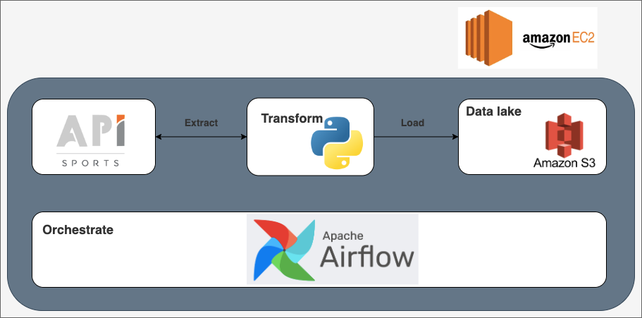

# Football Data ETL Project with Airflow, API Sports, and Amazon S3

## Project Description

This project implements an ETL (Extract, Transform, Load) pipeline to fetch football data from the API Sports, transform it using Python, and then load it into a data lake on Amazon S3. The pipeline is orchestrated by Apache Airflow, deployed on an Amazon EC2 instance.

### Project Architecture



1. **Extract**: Retrieve data from the API Sports.
2. **Transform**: Process and format the data.
3. **Load**: Store the transformed data in an S3 bucket (data lake).
4. **Orchestration**: Apache Airflow orchestrates the ETL process.

## Prerequisites

- **Python 3**
- **Airflow** installed on Amazon EC2
- **API Sports** for retrieving football data (requires an API key)
- **Amazon S3** for storing transformed data
- **Python-dotenv** to manage secrets via a `.env` file
- **Boto3** to interact with Amazon S3

## Configuration

1. **`.env` File**

   Create a `.env` file at the project root to store sensitive information, such as API keys and AWS credentials.

   ```plaintext
   API_HOST="v3.football.api-sports.io"
   API_KEY="your_api_key_here"

   AWS_ACCESS_KEY_ID="your_access_key_id"
   AWS_SECRET_ACCESS_KEY="your_secret_access_key"
   BUCKET_NAME="your-s3-bucket-name"
   S3_KEY="football_data/standings_data.csv"
   ```

## Pipeline Tasks

Each stage of the ETL process is defined as a separate task within the DAG:

1. **is_football_api_ready**: Checks if the API is accessible and ready to serve data.
2. **extract_data**: Makes a request to the API, retrieves the raw data, and stores it temporarily.
3. **transform_data**: Processes the raw data, converting it into a structured format (e.g., DataFrame), and performs any necessary transformations.
4. **save_to_s3**: Uploads the transformed data to the specified S3 bucket and path.
